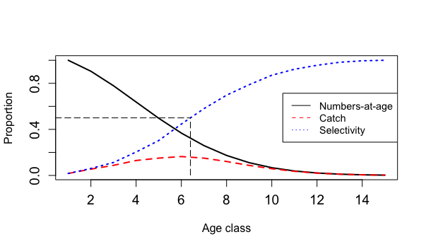

This repository contains data and code to estimate daily natural mortality rates for various YOY nekton species collected in salt marshes of the Mississippi Sound, Coastal Alabama. Natural mortality rates are estimated by two modelling approaches:

### 1. The length-converted catch curve

For a single cohort (i.e. a generation born at the same time as a result of the same reproductive period), we assume numbers-at-age ($N_a$) decrease over time according to an instantaneous rate of natural mortality (M):

$$
N_t = N_{t-1}e^{-M}
$$

$$
log N_t = logN_{t-1} - M
$$

Since we only have length composition data, we must convert the observed lengths into relative ages \$a_L\$ to track the decline in numbers over time. We can do this with knowledge of growth parameters:

$$
a_L = t_0 - (1/k) log(1 - L/L_{\infty})
$$

where $t_0$, $k$, and $L_{\infty}$ are the growth parameters of the von Bertalanffy growth function (VBGF). The VBGF describes how the length of an individual grows over time, and is given by:

$$
L(t) = L_{\infty} (1 - e^{-k(t - t_0)})
$$

where $L(t)$ is the length at time $t$.

The mortality rate (in this case, $M$) is then estimated by simply fitting a linear regression to the log-transformed numbers-at-age data, where the slope of the regression line is equal to $-M$ (de Barros et al. 2024)

### 2. The catch composition model

The catch composition model is a more complex approach that accounts for selectivity-at-age to predict the observed length composition of a population.
It uses a Bayesian framework to estimate the natural mortality rate and selectivity parameters simultaneously.

The model ($/stan/cc.stan$) is implemented in the Stan probabilistic programming language, and is specified as follows:

Let $C_{i,k}$ be the observed catch at relative age bin $i$ and species $k$. $C_{i,k}$ follows a Multinomial distribution with parameters $n_{i,k}$ (the number of individuals in age bin $i$ for species $k$) and $\pi_{i,k}$ (the proportion of individuals in age bin $i$ for species $k$): 

$$
C_{i,k} \sim \text{Multinomial}(n_{i,k}, \pi_{i,k})
$$

where $\pi_{i,k}$ is given by:

$$
\pi_{i,k} = \frac{N_{a,k} \cdot S_{a,k}}{\sum_{j=1}^{N} N_{a,k} \cdot S_{a,k}}
$$

where $N_{a,k}$ is the number of individuals at relative age $a$ for species $k$, and $S_{a,k}$ is the selectivity-at-age for species $k$. The selectivity-at-age is modelled as a logistic function:

$$
S_{a,k} = \frac{1}{1 + e^{-s(a - s_{50,k})}}
$$

where $s$ is the steepness of the selectivity curve and $s_{50,k}$ is the age at which 50% of individuals are selected for species $k$.

The number of individuals at relative age $a$ for species $k$ is given by:

$$
N_{a,k} = N_{a-1} \cdot e^{-M_k}
$$

Prior distributions of parameters are specified as follows:

$$
M_k \sim \text{Normal}(\mu_{M_{k}}, \sigma_{\mu_{M_{k}}})
$$

$$
\sigma_{M_{k}} \sim \text{Half-Cauchy}(0, 1)
$$

$$
a_{50_{k}} \sim \text{Normal}(\mu_{a_{50,k}}, \sigma_{\mu_{a_{50,k}}})
$$

$$
\sigma_{a_{50,k}} \sim \text{Half-Cauchy}(0, 1)
$$

The full likelihood of the model is therefore given by the follwing expression:

$$
\mathcal{L} = \prod_{k=1}^{K} \prod_{i=1}^{N} \frac{n_{i,k}!}{C_{i,k}!} \cdot \pi_{i,k}^{C_{i,k}} \cdot (1 - \pi_{i,k})^{n_{i,k} - C_{i,k}} \cdot S_{a,k}
$$

And the log-likelihood:

$$
\log \mathcal{L} = \sum_{k=1}^{K} \sum_{i=1}^{N} \left( C_{i,k} \log(\pi_{i,k}) + (n_{i,k} - C_{i,k}) \log(1 - \pi_{i,k}) + \log(S_{a,k}) \right)
$$

### How to run the models

1. Catch curves: run "/run/01_run_catch_curves.R"
2. Catch composition model: run "/run/02_run_catch_comps.R"
3. To visualize the results, run "/run/03_plots_and_tables.R"

Make sure to run in the specified order.

### References
de Barros, M., Oliveira-Filho, R., Aschenbrenner, A., Hostim-Silva, M., Chiquieri, J., & Schwamborn, R. (2024). Evaluation of traditional and bootstrapped methods for assessing data-poor fisheries: a case study on tropical seabob shrimp (Xiphopenaeus kroyeri) with an improved length-based mortality estimation method. PeerJ, 12, e18397.

